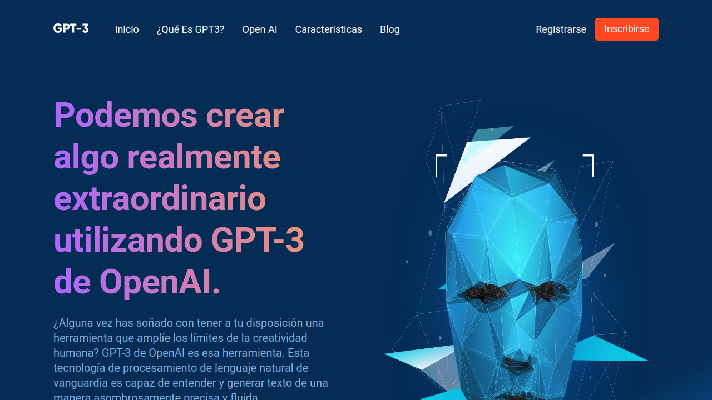
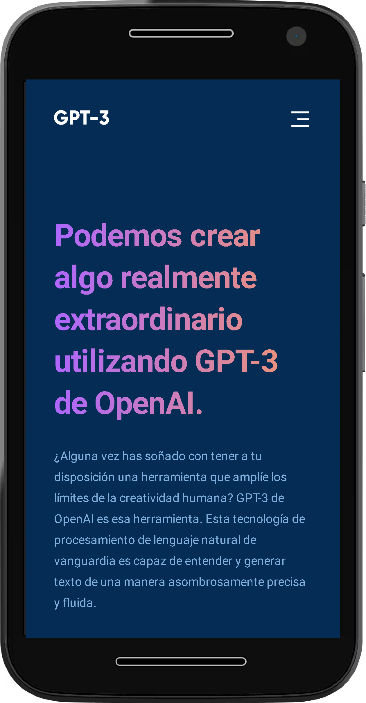

# Modern UI-UX GPT3

## Descripción

Código base de la Interfaz Moderna de la IA GPT-3 hecha en React.js.

---

## Vista En Versión Desktop

## Vista En Versión Mobile

---

## Enlace A La Aplicación

- [GPT-3](https://axe10rellanamodern-ui-ux-gpt3.netlify.app/)

---

## Hecho con

- [React](https://react.dev/) - JS library

---

## Comandos

- npm i
- npm start
- npm run build

---

## Dependencias

- React
- react-icons

---

## Autor

- Website - [Axe10rellana](https://axe10rellana.github.io/portafolio/portafolio/)
